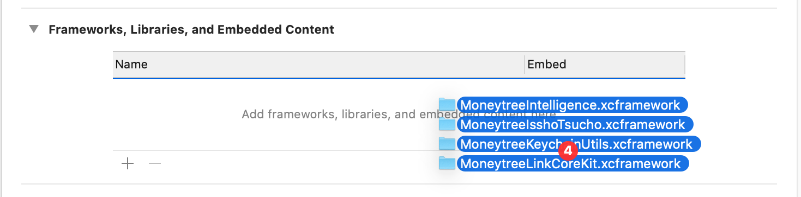

# Moneytree Link SDK (iOS)

The ***Moneytree Link SDK*** is a toolbox you can use to integrate with Moneytree's services.

The SDK provides ways to authenticate, store tokens, and launch Moneytree web services. It also provides a plugin for ***LINK Kit***, a fully integrated web PFM solution.

> :information_source: All code samples provided here are examples for your convenience.

## Contents

- [Moneytree Link SDK (iOS)](#moneytree-link-sdk-ios)
  - [Contents](#contents)
  - [Integration Guide](#integration-guide)
    - [Getting the SDK](#getting-the-sdk)
      - [Using Swift Package Manager](#using-swift-package-manager)
      - [Using CocoaPods](#using-cocoapods)
      - [Installing the SDK manually](#installing-the-sdk-manually)
    - [Configuring your project](#configuring-your-project)
    - [Initializing the SDK](#initializing-the-sdk)
      - [Creating the SDK Configuration](#creating-the-sdk-configuration)
      - [Configuring Scopes](#configuring-scopes)
    - [Starting the SDK](#starting-the-sdk)
    - [Configuring Deep Links for authorization](#configuring-deep-links-for-authorization)
    - [Configuring Universal Links for navigation](#configuring-universal-links-for-navigation)
    - [Additional configuration for Passwordless Sign Up/Login and Login Link](#additional-configuration-for-passwordless-sign-uplogin-and-login-link)
    - [Configuring the MTLinkClientDelegate (optional)](#configuring-the-mtlinkclientdelegate-optional)
      - [Events](#events)
  - [Using the SDK](#using-the-sdk)
  - [Migration Guides](#migration-guides)
  - [Troubleshooting](#troubleshooting)

## Integration Guide

The Moneytree Link SDK is comprised of a Core SDK and the LINK Kit module.

The Core SDK is the tool offering you all the connectivity to our services plus some state handling options for tokens.

LINK Kit is a web-based PFM service and is available as an SDK module to simplify the integration process.

> :information_source: LINK Kit is the name of the refreshed and re-branded version of Issho Tsucho.

### Getting the SDK

> :warning:
>
> - The SDK requires a minimum deployment target of iOS 9.0.
> - The minimum Xcode version supported for development is 12.0.

We strongly recommend using Swift Package Manager. There are several other installation methods available, but we will best be able to support you via SPM.

#### Using Swift Package Manager

1. In Xcode, select `File > Swift Packages > Add Package Dependency`.
1. The package URL is `https://github.com/moneytree/moneytree-link-ios-sdk`. Use a minimum version of `6.0.0`.
    - If you want to use a beta version, select `Rules: Commit` and copy the full SHA of the beta release commit.

#### Using CocoaPods

1. At the root of your project, run `pod init`. This creates a `Podfile`.
1. Add the following to your `Podfile`.

        pod 'MoneytreeLinkSDK' , '~> 6.0'

1. Run the following command at the root of your project

        pod install --repo-update

1. Open `<project>`.xcworkspace.

#### Installing the SDK manually

1. Download the latest XCFrameworks from the latest v6.0.0 release [here](https://github.com/moneytree/moneytree-link-ios-sdk/releases).
1. Drag the downloaded `.xcframework` files into your app target.


### Configuring your project

Your app must be configured with your Moneytree client ID in order to connect to Moneytree's services. You must also configure a custom URL scheme in order to receive callbacks from those services.

In your app's `Info.plist` file:

1. Add two entries: `MoneytreeLinkDevClientId` and `MoneytreeLinkClientId`. Please [contact the Moneytree team](https://getmoneytree.com/jp/link/contact) if you don't have client IDs.
   1. The values are `String`s, and they are your **Development** and **Production** client IDs.
   2. The **Development** client ID is used to connect to the `staging` environment of Moneytree Link when the SDK is configured in `staging` mode.
   3. The **Production** client ID is used to connect to the `production` environment of Moneytree Link when the SDK is configured in `production` mode.
   4. More details can be found [below](#creating-the-sdk-configuration).
2. Add the entry `URL types` (CFBundleURLTypes) **if** it is not there.
3. Add the following 2 entries under `URL types` in order to receive callbacks from the SDK.
   1. For **Development**, add `mtlink<development-clientId-short>`. `<development-clientId-short>` is the first 5 characters of your **Development** client ID.
   2. For **Production**, add `mtlink<production-clientId-short>`. `production-clientId-short` is the first 5 characters of your **Production** client ID.

Example XML from Info.plist

  ```xml
    <key>MoneytreeLinkDevClientId</key>
    <string>{your-dev-client-id}</string>
    <key>MoneytreeLinkClientId</key>
    <string>{your-client-id}</string>
    <key>CFBundleURLTypes</key>
    <array>
      <dict>
        <key>CFBundleTypeRole</key>
        <string>Editor</string>
        <key>CFBundleURLSchemes</key>
        <array>
          <string>mtlink{your-dev-client-id-first-5}</string>
        </array>
      </dict>
      <dict>
        <key>CFBundleTypeRole</key>
        <string>Editor</string>
        <key>CFBundleURLSchemes</key>
        <array>
          <string>mtlink{your-client-id-first-5}</string>
        </array>
      </dict>
    </array>
  ```

### Initializing the SDK

We recommend initializing the SDK in your app delegate, so that the SDK can be available for the lifetime of your application. Deep links and callbacks must also be configured within other app delegate methods. You will need to import the `MoneytreeLinkCoreKit` module wherever you are initializing and configuring the SDK.

#### Creating the SDK Configuration

Initialize the configuration object as appropriate for your authorization type. Then configure it according to your needs.

```swift
// PKCE requires no arguments.
let configuration = MTLConfiguration()

// Code Grant requires the redirect URI of your code grant server.
let configuration = MTLConfiguration(redirectUri: "https://your.server.com/token-exchange-endpoint")

// Set environment to `.staging` for development builds or `.production` for production builds.
configuration.environment = .staging

// Configure the OAuth scopes
// Please refer to the table below for the recommended scopes for specific features
configuration.scopes = [
  MTLClientScopeGuestRead,
  MTLClientScopeAccountsRead,
  MTLClientScopeTransactionsRead
]
```

#### Configuring Scopes

All available scopes

| Scope                                    | Description                                                                                                         |
| :--------------------------------------- | :------------------------------------------------------------------------------------------------------------------ |
| MTLClientScopeGuestRead                  | Access to basic account information.                                                                                |
| MTLClientScopeAccountsRead               | Access to read personal account balances and information.                                                           |
| MTLClientScopeTransactionsRead           | Access to read personal account transactions.                                                                       |
| MTLClientScopeTransactionsWrite          | Access to write personal account transactions.                                                                      |
| MTLClientScopeCategoriesRead             | Access to read transaction categories.                                                                              |
| MTLClientScopeInvestmentAccountsRead     | Access to read investment account balances and information.                                                         |
| MTLClientScopeInvestmentTransactionsRead | Access to read investment account transactions.                                                                     |
| MTLClientScopeRequestRefresh             | Allows your application to manually request Moneytree to retrieve up-to-date user data from financial institutions. |
| MTLClientScopePointsRead                 | Access to read point account information.                                                                           |
| MTLClientScopePointTransactionsRead      | Access to read point account transactions.                                                                          |
| MTLClientScopeNotificationsRead          | Access to read notification information.                                                                            |

Recommended scopes for features

| Feature          | Recommended Scopes                                                                  |
| :--------------- | :---------------------------------------------------------------------------------- |
| Vault Access     | MTLClientScopeGuestRead, MTLClientScopeAccountsRead, MTLClientScopeTransactionsRead |
| Customer Support | MTLClientScopeGuestRead, MTLClientScopeAccountsRead, MTLClientScopeTransactionsRead |

Required scopes for features

| Feature  | Required Scopes                                                                                                                                                                                                                |
| :------- | :----------------------------------------------------------------------------------------------------------------------------------------------------------------------------------------------------------------------------- |
| LINK Kit | MTLClientScopeGuestRead, MTLClientScopeAccountsRead, MTLClientScopeTransactionsRead, MTLClientScopeTransactionsWrite, MTLClientScopePointsRead, MTLClientScopeInvestmentAccountsRead, MTLClientScopeInvestmentTransactionsRead |

### Starting the SDK

Inside `application:didFinishLaunchingWithOptions:`, write the below.

```swift
MTLinkClient(configuration: configuration)
```

### Configuring Deep Links for authorization

Configure your app delegate to forward callbacks via the URL schemes you configured in your project's `Info.plist` to the Moneytree LINK SDK. This is **required** for critical functionality of the SDK, such as authorization, to function.

```swift
func application(
  _ app: UIApplication,
  open url: URL,
  options: [UIApplicationOpenURLOptionsKey: Any] = [:]
) -> Bool {
  // You may handle other URL schemes before calling MTLApplicationDelegate.
  let moneytreeLinkOpenedURL = MTLApplicationDelegate.shared.application(app, open: url, options: options)
  if moneytreeLinkOpenedURL {
    return true
  }
}
```

### Configuring Universal Links for navigation

This allows the SDK to handle the universal links sent from the Moneytree LINK server. This is used to navigate to specific services, including:

- Handling `Login Link` for Moneytree LINK log in.
- Opening Moneytree LINK Account Settings.

> :warning: Please make sure your `apple-app-site-association` is properly hosted, if you are not sure, please contact Moneytree.

```swift
func application(
  _ application: UIApplication,
  continue userActivity: NSUserActivity,
  restorationHandler: @escaping ([UIUserActivityRestoring]?) -> Void
) -> Bool {
  let canMoneytreeHandleUserActivity = MTLApplicationDelegate.shared.application(application, userActivity: userActivity) { error in
    // Handle universal link handling result/error if necessary
  }
  // If Moneytree cannot handle this user activity, check if other party can
  return canMoneytreeHandleUserActivity
}
```

### Additional configuration for Passwordless Sign Up/Login and Login Link

See [Authorizing with Passwordless Sign Up/Login and Login Link](Documentation/Features.md#authorizing-with-passwordless-sign-uplogin-and-login-link) for how to finish configuring these features.

### Configuring the MTLinkClientDelegate (optional)

Please implement this delegate if your app needs custom behavior for specific events, such as when the vault is closed, or when a new credential is added.

#### Events

| Status                               | Value | Error                              |
| :----------------------------------- | :---: | :--------------------------------- |
| error                                |   0   | contains error                     |
| vaultDidClose                        |   1   | doesn't contain error (always nil) |
| newCredentialAddedViaThirdPartyOauth |   2   | doesn't contain error (always nil) |

```swift
// Your chosen delegate class (in this example, the app delegate) must conform to MTLinkClientDelegate.
class AppDelegate: MTLinkClientDelegate {
  func application(_ application: UIApplication, didFinishLaunchingWithOptions launchOptions: [UIApplication.LaunchOptionsKey: Any]?) -> Bool {
    let mtLinkClient = MTLinkClient(configuration: configuration)

    // Set the delegate.
    mtLinkClient.delegate = self

    return true
  }

  // Implement this delegate method.
  func clientStatusDidChange(to status: MTLinkClientStatus) {
    // Handle status change
  }
}
```

## [Using the SDK](Documentation/Features.md)

## Migration Guides

- [v5 to v6](Documentation/MigrationGuides/5to6.md)

## Troubleshooting

You might have questions concerning the integration of the SDK in your application. We are happy to provide support.

On that front we would appreciate if you can provide us the following information:

- Environment information like:
  - SDK version
  - iOS version
  - Anything else that might be specific to your setup
- A simple project that can reproduce your issue
  - We recommend you try and reproduce your issue by modifying the ***AwesomeApp***. If not able then any working sample will do. It can be hard to find issues without the implementation details.
- Anything else you might think that can help us identify the problem and help you with it.
