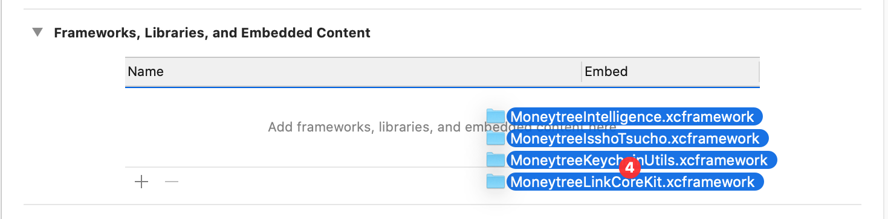

# Moneytree Link SDK for iOS

- [Installation](#installation)
  - [Swift Package Manager](#swift-package-manager)
  - [CocoaPods](#cocoapods)
  - [Manual](#manual)
- [Integration Guide](#integration-guide)
  - [Configure the project](#1-configure-the-project)
  - [Initialize the SDK](#2-initialize-the-sdk)
  - [Features Available](#3-features-available)
- [Change log](#change-log)
- [Migration guides](#migration-guides)

**All code snippets provided here are examples for your convenience.**

## Requirement
- The minimum iOS version supported by your app should be iOS 9.0.
- The minimum Xcode version supported for development is 11.0.

## Installation

### Swift Package Manager
**Note:** available on `Xcode 12` and above

1. In Xcode, select `File > Swift Packages > Add Package Dependency`.
1. Follow the prompts using the URL for this repository with a minimum version of v6.0.0.
1. Add the framework to the project.

### CocoaPods
**Note:** available on `Xcode 11` and above

1. At the root of your project, run `pod init`, it creates a `Podfile`.
1. Add the following to the `Podfile` and save it:

        pod 'MoneytreeLinkSDK'

1. Run the following command at the root of your project

        pod install --repo-update

1. Open `<project>`.xcworkspace.

### Manual

1. Download the latest XCFrameworks from the latest v6.0.0 release [here](https://github.com/moneytree/moneytree-link-ios-sdk/releases).
1. Drag the downloaded `.xcframework` files into your app target.

## Integration Guide

- ### 1. [Configure the Project](Documentation/ProjectConfiguration.md)
- ### 2. [Initialize the SDK](Documentation/SDKInitialization.md)
- ### 3. [Features Available](Documentation/Features.md)

## Change Log
Please find the complete changelog [here](CHANGELOG.md).

## Migration Guides

- [v5 to v6](Documentation/MigrationGuides/5to6.md)

